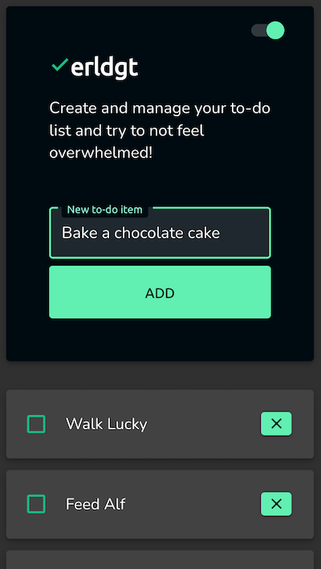
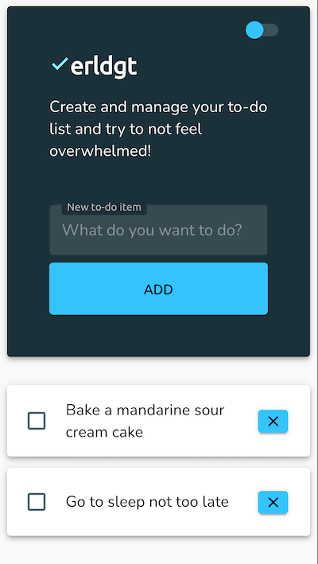
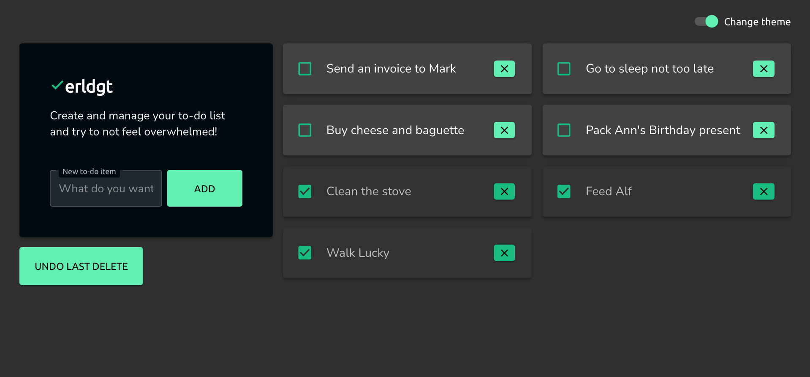

# ✔︎erldgt: the to-do app

An experimental yet simple to-do web app built with React and ♡.

**`Keep current tasks & plans under control from a tab in your favorite browser!`**

See it in action: [erldgt: the to-do app](https://olhanotolga.github.io/erldgt-dream-todo/)

## What you can do

* [x] Add new to-do items to the list
* [x] Mark items as done
* [x] Change priority by moving items around
* [x] Delete items from the list
* [x] Bring back the last deleted item
* [x] Change between light and dark themes

## Screenshots

## What I used

* **Functionality:** React (functional components with standard Hooks)
* **Drag and drop:** react-beautiful-dnd
* **Style:** Material UI
* **Data storage:** localStorage

This project was bootstrapped with [Create React App](https://github.com/facebook/create-react-app).

## How to run the app locally

Clone the repository and run `npm install` in the project directory to install the dependencies.

`yarn start` / `npm run start` — Runs the app in the development mode.\
Open [http://localhost:3000](http://localhost:3000) to view it in the browser.

`yarn test` / `npm run test` — Launches the test runner in the interactive watch mode.\

`yarn build` / `npm run build` — Builds the app for production to the `build` folder.\
It correctly bundles React in production mode and optimizes the build for the best performance.

`yarn eject` / `npm run eject` — This command will remove the single build dependency from your project. Instead, it will copy all the configuration files and the transitive dependencies (webpack, Babel, ESLint, etc) right into your project so you have full control over them. **Note: this is a one-way operation. Once you `eject`, you can’t go back!**

You can learn more in the [Create React App documentation](https://facebook.github.io/create-react-app/docs/getting-started).
